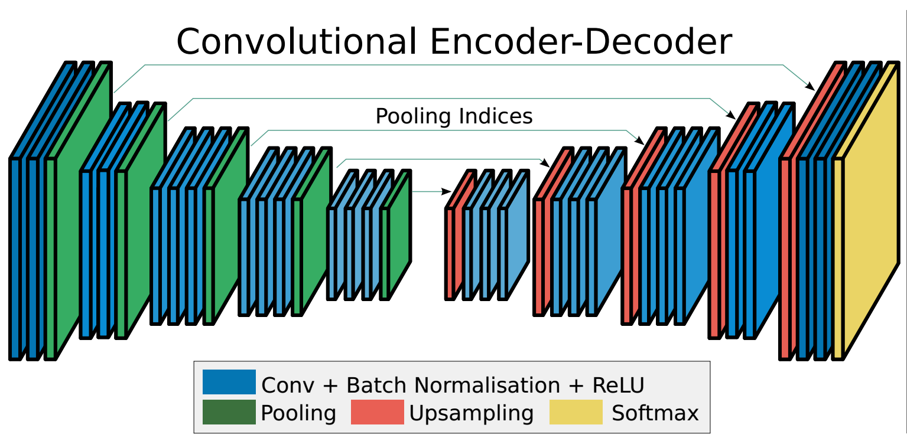
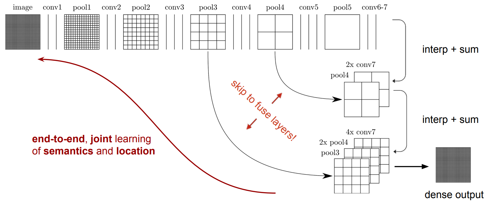
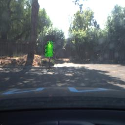

# Coding Self-Driving Car CARLA

The goal of this project is to code a real self-driving car to drive itself on a test track using [ROS](http://www.ros.org/) and [Autoware](https://github.com/CPFL/Autoware). The project is coded to run on Udacity simulator as well as on Udacity's own self-driving car _CARLA_.


A demo video can be viewed at [this link](https://youtu.be/zid5BqIE600)

### Installation

* Be sure that your workstation is running Ubuntu 16.04 Xenial Xerus or Ubuntu 14.04 Trusty Tahir. [Ubuntu downloads can be found here](https://www.ubuntu.com/download/desktop).
* If using a Virtual Machine to install Ubuntu, use the following configuration as minimum:
  * 2 CPU
  * 2 GB system memory
  * 25 GB of free hard drive space

  The Udacity provided virtual machine has ROS and Dataspeed DBW already installed, so you can skip the next two steps if you are using this.

* Follow these instructions to install ROS
  * [ROS Kinetic](http://wiki.ros.org/kinetic/Installation/Ubuntu) if you have Ubuntu 16.04.
  * [ROS Indigo](http://wiki.ros.org/indigo/Installation/Ubuntu) if you have Ubuntu 14.04.
* [Dataspeed DBW](https://bitbucket.org/DataspeedInc/dbw_mkz_ros)
  * Use this option to install the SDK on a workstation that already has ROS installed: [One Line SDK Install (binary)](https://bitbucket.org/DataspeedInc/dbw_mkz_ros/src/81e63fcc335d7b64139d7482017d6a97b405e250/ROS_SETUP.md?fileviewer=file-view-default)
* Download the [Udacity Simulator](https://github.com/udacity/CarND-Capstone/releases/tag/v1.2).

### Usage

1. Clone the project repository

	```bash
	git clone https://github.com/ucatie/CarND-Capstone
	```

2. Install python dependencies

	```bash
	cd CarND-Capstone/CarND-Capstone
	pip install -r requirements.txt
	```
3. Make and run styx

	```bash
	cd ros
	catkin_make
	source devel/setup.sh
	roslaunch launch/styx.launch
	```
4. Run the simulator

5. In order to run the code on CARLA, it is necessary to use a different classifier: A SVM is used in the simulator environment, while a FCN is used to detect traffic lights in the real world. Therefore, it is necessary to download the trained FCN network (based on VGG) snapshot. Due to the size of the file, it cannot be hosted in GitHub, so please use the following link to download: [Trained FCN snapshot](https://drive.google.com/open?id=0B-varHdnnrqsMDI2QVM4bEo3VUU)
We tried to avoid that, but freezing the graph of the FCN did not work, a solution was not found. It seems to be a typical problem on pretrained models,
therefore the model is too big, to be uploaded to github.
If the project is submitted using a zip, the project zip contains as well the model files.

### Real world testing

1. Download [training bag](https://drive.google.com/file/d/0B2_h37bMVw3iYkdJTlRSUlJIamM/view?usp=sharing) that was recorded on the Udacity self-driving car (a bag demonstrating the correct predictions in autonomous mode can be found [here](https://drive.google.com/open?id=0B2_h37bMVw3iT0ZEdlF4N01QbHc))
2. Unzip the file
```bash
unzip traffic_light_bag_files.zip
```
3. Play the bag file
```bash
rosbag play -l traffic_light_bag_files/loop_with_traffic_light.bag
```
4. Launch your project in site mode
```bash
cd CarND-Capstone/ros
roslaunch launch/site.launch
```
5. Confirm that traffic light detection works on real life images

## ROS Nodes Description

#### Waypoint Updater node (waypoint_updater)

This node publishes the next 100 waypoints that are closest to vehicle's current location and are ahead of the vehicle. This node also considers obstacles and traffic lights to set the velocity for each waypoint.

This node subscribes to following topics:

1. **/base_waypoints:** Waypoints for the whole track are published to this topic. This publication is a one-time only operation. The waypoint updater node receives these waypoints, stores them for later use and uses these points to extract the next 100 points ahead of the vehicle.
2. **/traffic_waypoint:** To receive the index of the waypoint in the base_waypoints list, which is closest to the red traffic light so that the vehicle can be stopped. The waypoint updater node uses this index to calculate the distance from the vehicle to the traffic light if the traffic light is red and the car needs to be stopped.
3. **/current_pose:** To receive current position of vehicle.
4. **/current_velocity:** To receive current velocity of the vehicle which is used to estimate the time the car needs to reach the traffic light’s stop line.

The waypoint updater node finds the closest waypoint to the vehicle’s current position and converts it to the vehicle’s coordinate system to find out of this waypoint is ahead (x >= 0) of the vehicle. Then it sets the velocity of the next 100 waypoints and publishes them as final_waypoints. If the car approaches a red traffic light, it lowers the velocity of these 100 waypoints to stop the vehicle at the stop line.

This node publishes to following topics:

1. **/final_waypoints:** Selected 100 waypoints including their velocity information are published to this topic.


#### DBW Node (dbw_node)

This node is responsible for vehicle control (acceleration, steering, brake).

This node subscribes to the following topics:

1. **/final_waypoints:** Next 100 waypoints ahead of the vehicle's current position are published to this topic. DBW node uses these points to fit a polynomial and to calculate the cross track error based on that polynomial and the vehicle's current location.
2. **/current_pose:** To receive the current position of the vehicle.
3. **/current_velocity:** To receive the current velocity of the vehicle.
4. **/twist_cmd:** Target vehicle linear and angular velocities in the form of twist commands are published to this topic.
5. **/vehicle/dbw_enabled:** Indicates if the car is under dbw or driver control.

This node publishes to following topics:

1. **/vehicle/steering_cmd:** Steering commands are published to this topic.
2. **/vehicle/throttle_cmd:** Throttle commands are published to this topic.
3. **/vehicle/brake_cmd:** Brake commands are published to this topic.

To calculate vehicle control commands for steering, throttle and brake this node makes use of _Controller_ which in turn uses the following four PID controllers and a low pass filter.

1. **PID Controller for velocity** to drive the vehicle with target velocity. It uses this PID controller with the following parameters.
	```
	VELOCITY_Kp = 2.0
	VELOCITY_Ki = 0.0
	VELOCITY_Kd = 0.0
	```
Based on the output of this PID controller, the target linear acceleration will be calculated and used in the acceleration controller described below. When the linear velocity is below the target velocity, the controller will output a positive value and viceversa.

2. **PID Controller for acceleration** to accelerate the vehicle smoothly. It uses this PID controller with the following parameters
	```
	ACCEL_Kp = 0.4
	ACCEL_Ki = 0.1
	ACCEL_Kd = 0.0
	```
This controller will generate the control value to drive both the throttle and brake of the car.

Since the throttle command is given as a percentage, the output of this PID will be directly used to generate the throttle value.

However, in the case of the brake command value, the needed units are given as braking torque. Therefore, the output of the acceleration PID will be multiplied by an estimate of the overall car mass and the wheel radius, both provided as initialization parameters for the controller.
Furthermore, brake dead-band is also taken into account to avoid constant braking on situation on which the acceleration PID outputs values in the vicinity of zero.

3. **PID Controller for steering angle** to reduce the error of target steering angle calculated using _Yaw Controller_. It uses the following parameters
	```
	STEER_Kp = 0.8
	STEER_Ki = 0.1
	STEER_Kd = 0.3
	```
4. **Yaw Controller** to calculate the steering angle based on the current linear velocity and the target linear and angular velocity. The result of this controller is added to the error value received from _PID Controller for steering angle_.

This controller will simply use target angular velocity (rate of turn) and target linear speed to estimate the curvature radius of the road.

It will then apply the bicycle model and use the steering wheel ratio, the wheel base and the road radius to calculate the needed steering wheel angle.

All of the above will be done considering maximum/minimum limits of both steering wheel angle and lateral acceleration.

5. **Low pass filter for acceleration** is used in conjunction with _PID controller for acceleration_ to calculate acceleration commands. It uses following parameters
	```
	ACCEL_Tau = 0.5
	ACCEL_Ts = 0.02
	```
The PID controllers are reset when the DBW status changes. For example when a safety driver takes over.

#### Traffic light detection node (tl_detector)

This node is responsible for detecting and classifying traffic lights. If the traffic light is identified as red then it finds the closest waypoint to that red light's stop line and publishes the index of that waypoint to the _/traffic_waypoint_ topic.

This node subscribes to the following topics:

1. **/base_waypoints:** Waypoints for the whole track are published to this topic. This publication is a one-time only operation.
2. **/current_pose:** To receive the current position of the vehicle.
3. **/image_color:** To receive camera images to identify red lights from. Every time a new image is received, the traffic light detection node saves it so that it can process it in the next iteration of its processing loop which runs at a rate of 5Hz.
4. **/vehicle/traffic_lights:** If ground truth data has been created. This topic provides the location of the traffic light in 3D map space and helps acquiring an accurate ground truth data source for the traffic light classifier by sending the current color state of all traffic lights in the simulator. When testing on the vehicle, the color state will not be available. You'll need to rely on the position of the light and the camera image to predict it.

This node publishes to the following topics:

1. **/traffic_waypoint:** To publish the index of the closest waypoint to the red traffic light's stop line.
2. **/traffic_light:** To publish upcoming traffic light information (TrafficLight)
3. **/traffic_light_image:** To publish cropped images of traffic lights for testing. This topic is just for testing purposes in case someone wants to view the images with tools like rviz.

Parameters are used to define and create ground truth and/or training data. Please check the launch file.

- The node starts with loading the parameters from the parameter server to check if ground truth images need to be created and if the node is running in the simulator or the real world to use classes accordingly.
- The traffic light detection node runs at rate of 5Hz.
- Each traffic light state must be detected `STATE_COUNT_THRESHOLD=3` times before it will be used, otherwise the previous predicted light state will be used.

- In each iteration of the processing loop
	- It extracts all the traffic light waypoints.
	- It transforms each traffic light waypoint to the vehicle's coordinate system.
	- It finds the traffic light waypoint that is closest to the vehicle. It finds the closest waypoint by transforming the waypoints to the vehicle's coordinate system.
	- After finding the traffic light waypoint if the distance from that traffic light waypoint is less than a certain threshold then it is considered otherwise discarded.
	- If traffic light is close then traffic light state (red, green, yellow) is identified using the last image received from on vehicle camera and the `TLClassifier` class present in `tl_detector/light_classification/tl_classifier.py`.
	- This identified state of traffic light must be detected for a certain threshold `STATE_COUNT_THRESHOLD` for it to be accepted.
	- If the new traffic light state is detected more than `STATE_COUNT_THRESHOLD` times then we check previous light state also to classify new light state as _green to yellow or red light_
	- If red light (green to yellow or red light) state is detected then its corresponding waypoint is published to `/traffic_waypoint`


#### SVM Training Node for Traffic Light Detection and Classification (tl\_detector\_train)

The classification model used for real world is different than that of simulator.

##### For Simulator

Node to train an SVM for four states (red, green, yellow). Features like HOG, spatial and histogram are collected and in different color spaces.
Data is read as defined by parameters in launch file so that different techniques, features and color space selection can be tried just by changing parameters as parameters allow different operations on the SVM training. Run it with following command.

```
roslaunch tl_detector train_sim_svm.launch
```

If task "best" is executed a trained svc.p file is written, which is used in the tl_classifier. Using RGB color space, all channels, and spatial and histogram only features for feature space we got `99% accuracy` on red 1290 green 213 yellow 203 unknown 56 images.

##### For Real World
A Fully Convolutional Neural Network is trained for segmentation of real world images to find a bitmap that contains a traffic light. This fully convolutional networks follows exactly the same architecture as used in the Semantic Segmentation project in term 3 of the Nanodegree.
The paper [Fully Convolutional Networks for Semantic Segmentation](https://arxiv.org/pdf/1605.06211.pdf) provides an excellent description of the network architecture in use, based on VGG. Nevertheless, the image below provides a synthetic view of the overall FCN idea.



A FCN will basically be composed of a standard convolutional network (in our case based of VGG), where the fully connected layers will be removed and replaced by 1x1 convolutions, allowing the preservation of the spatial information. Successive transposed convolutions and upscaling layers will then be added, so that the output of the network is of the same size of the input image. The values of each of the output image "pixels" will be assigned as a function of the class to which each pixel belongs.
The addition of skip layers (bypassing several layers), allows the output image resolution of the classifier to remain close to that of the original image.

The figure below shows the exact architecture of the VGG-based FCN used to detect the presence of traffic lights (not their state, but only the overall location of the traffic lights within the image), including the use of the skip layers.



The classification of traffic light using the sub-image of the segmented image is done using an SVM as multiple class segmentation of the FCN was accurate enough. `light_classification\tl_fcn_classifier.py` contains the code for FCN segmentation.

The training of the FCN is started by calling tl\_detector\light\_classification\main1\_class.py



Node to train an SVM for four states (red, green, yellow). Features like HOG, spatial and histogram are collected and in different color spaces.
Data is read as defined by parameters in launch file so that different techniques, features and color space selection can be tried just by changing parameters as parameters allow different operations on the SVM training. Run it with following command.

```
roslaunch tl_detector train_real_svm.launch
```

If task "best" is executed a trained svc_real.p file is written, which is used in the tl_classifier. Using YCrCb color space, all channels, and spatial and histogram only features for feature space we got `100% accuracy` on red 183 green 325 yellow 131 images.


#### TLClassifier class (tl_classifier.py)

This class is used by _Traffic light detection node_. This class is used to classify traffic lights and uses a trained SVM model to do that. It starts by loading the trained SVC model, trained FCN and flag indicating whether code is running in simulator or not as classification model is different for simulator (binary images + SVM) and real world (FCN + SVM).

Classification is done in 2 steps.

1. **find_classification():** Given an image as input it returns the area containing the traffic light. This area of the image can then be fed to a classifier to classify.

	As we are using two different models (SVM and FCN) for simulator and real world respectively so process is different for simulator and real world.

	- **For Simulator:**
		- Three binary images are created with each containing pixels that have value that lies in range of red, green and yellow color and rest of the pixels are zeroed out.
		- After that, from these three binary images (red, green, yellow), binary image with maximum on pixels is selected.
		- Then sliding window technique is used to make up multiple windows to scan through region of interest in selected binary image. Windows with maximum on pixels are selected and a mean window of the selected windows is returned as region containing the traffic light.

	- **For Real World:**
		- The process is almost same for real world except instead of finding 3 binary images and then selecting one image, FCN is used to return segmented image.
		- Then sliding window technique is used to make up multiple windows to scan through region of interest in the segmented image. Windows with maximum on pixels are selected and a mean window of the selected windows is returned as region containing the traffic light.


2. **get_classification():** This method takes the area identified by `find_classification()` method as input and returns the state/class of the traffic light. Here is how it works.
	- Image is normalized first.
	- Then sliding window technique is used with sliding window size of 64 and stride 1.
	- `feature_detection.py` is used to collect features like HOG, spatial features and histogram. Feature detection is done with following parameters.

	```
	orient = 9  # HOG orientations
	pix_per_cell = 8 # HOG pixels per cell
	spatial_size = (16, 16) # Spatial binning dimensions
	hist_bins = 16    # Number of histogram bins
	```

	- SVM is used to classify all those windows into desired classes (red, green, yellow)
	- Class with maximum windows votes is selected as the final class.

#### tl\_classifier\_test Node

This node is for validating and testing of trained SVM model. Node to classify images of the data_gt or data_test folder. Uses the trained svc and calls tl_classifier code. Parameters are used to define the data folder and svc model file. To run it, execute following command.

```
roslaunch tl_detector test_sim_classifier.launch
roslaunch tl_detector test_real_classifier.launch
```

#### real\_bridge Node

The node publishes transformation messages required by the tl\_detection node and waypoint\_updater node to process rosbag play backs.

### Team Members

| Name                | Email                             | Slack        | TimeZone |
|:-------------------:|:---------------------------------:|:------------:|:--------:|
| Frank Schneider     | frank@schneider-ip.de             | @fsc         | UTC+2 |
| Sebastian Nietardt  | sebastian.nietardt@googlemail.com | @sebastian_n | UTC+2 |
| Sebastiano Di Paola | sebastiano.dipaola@gmail.com      | @abes975  	 | UTC+2 |
| Juan Pedro Hidalgo  | juanpedro.hidalgo@gmail.com       | @jphidalgo   | UTC+2 |
| Ramiz Raja          | informramiz@gmail.com             | @ramiz       | UTC+5 |

### Task break down table

Task break down and management has been done at:

[https://waffle.io/ucatie/CarND-Capstone](https://waffle.io/ucatie/CarND-Capstone)
